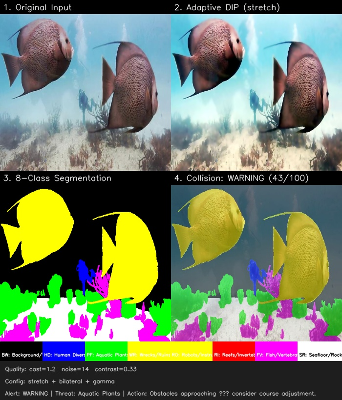
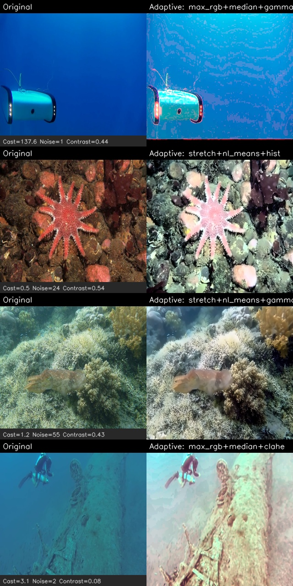
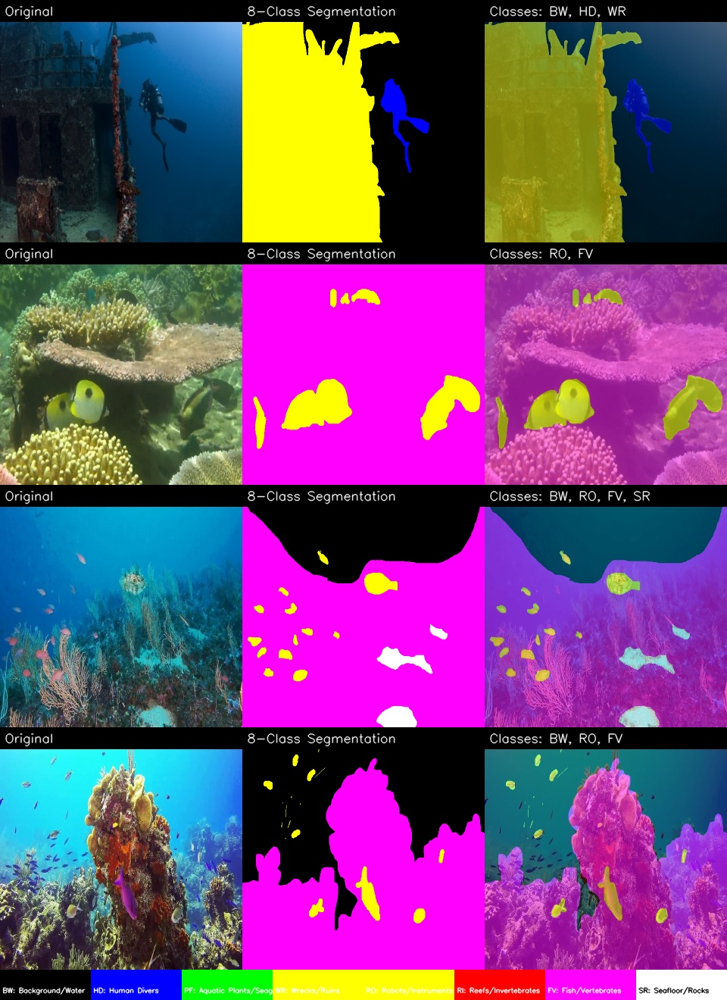
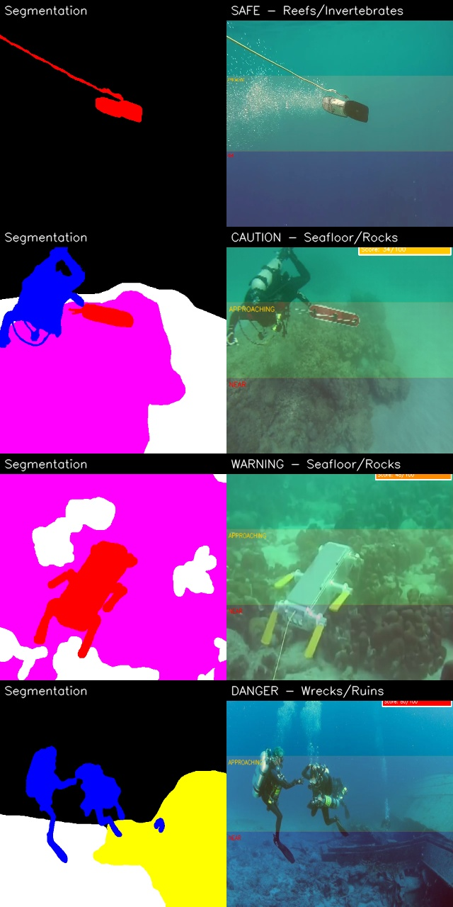
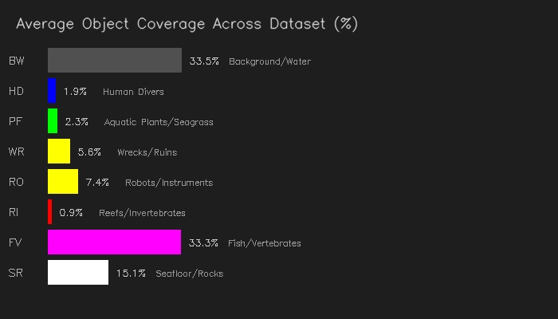

# 🌊 Hybrid DIP + ViT Underwater Segmentation with Collision Alert

Multi-class underwater scene understanding pipeline for autonomous underwater
vehicles (AUVs) and ROVs. Combines classical **Digital Image Processing (DIP)**
with a **Vision Transformer (ViT)** backbone for **8-class semantic segmentation**,
plus a **real-time collision risk assessment** system.

> Built with PyTorch · Streamlit · OpenCV · timm

---

## 📸 Results

### Full Pipeline Demo

End-to-end pipeline: Original Input → Adaptive DIP Enhancement → 8-Class Segmentation → Collision Alert with zone-based risk scoring.



---

### Adaptive DIP Preprocessing (Before vs After)

The system automatically analyses each image's degradation (colour cast, noise level, contrast) and selects the optimal preprocessing chain. No manual parameter tuning required.



---

### 8-Class Semantic Segmentation

ViT-based encoder with FPN decoder segments underwater scenes into 8 SUIM categories. Each column shows: Original → Predicted Mask → Overlay.



---

### Collision Alert System

Zone-based collision risk assessment across four threat levels — **SAFE**, **CAUTION**, **WARNING**, and **DANGER** — based on obstacle proximity and coverage in the drone's field of view.



---

### Object Coverage Analysis

Average per-class object coverage distribution across the test dataset.



---

## 🎯 Key Features

### 1. Multi-Class Segmentation (8 SUIM Categories)

| Class | Code | Colour | Collision Risk? |
|-------|------|--------|-----------------|
| Background/Water | BW | Black | No |
| Human Divers | HD | Blue | No |
| Aquatic Plants/Seagrass | PF | Green | Yes |
| Wrecks/Ruins | WR | Cyan | Yes |
| Robots/Instruments | RO | Yellow | No |
| Reefs/Invertebrates | RI | Red | Yes |
| Fish/Vertebrates | FV | Magenta | No |
| Seafloor/Rocks | SR | White | Yes |

### 2. Adaptive DIP Preprocessing (Quality-Aware)

The system automatically analyses each image's degradation level and selects
the optimal preprocessing chain:

- **Colour Cast Index** → selects Gray World, Max-RGB, or Histogram Stretch
- **Noise Level** → selects NL-Means, Bilateral, or Median filter
- **Contrast Ratio** → selects CLAHE, Gamma Correction, or Histogram EQ

### 3. Learnable Enhancement Stem + ViT Encoder

- Lightweight residual CNN block that learns image-space corrections
- Vision Transformer encoder with multi-scale FPN decoder
- End-to-end trainable with combined CE + Dice loss

### 4. Collision Alert System

Zone-based collision risk assessment for underwater drones:

- **Far zone** (top 1/3): distant objects (low weight)
- **Approaching zone** (middle 1/3): objects getting closer
- **Near zone** (bottom 1/3): imminent collision risk (high weight)
- **Centre detection**: objects directly in the drone's path

Risk levels: 🟢 SAFE → 🟡 CAUTION → 🟠 WARNING → 🔴 DANGER

### 5. Interactive Streamlit Web App

- Upload any underwater image for instant analysis
- Side-by-side comparison of original vs preprocessed vs segmented
- Live collision risk gauge and per-class coverage charts
- Model weights can be uploaded or downloaded directly from the UI

---

## 🗂️ Repository Structure

```
PROJECT/
├── app.py                         # Streamlit web application
├── suim_utils.py                  # Shared utilities (SUIM labels, model, DIP, collision)
├── train_multiclass.py            # Training script (8-class segmentation)
├── predict.py                     # Inference + coverage + collision alert
├── cache_dataset.py               # Offline preprocessing cache
├── requirements.txt               # Python dependencies
├── setup_env.bat                  # Windows GPU setup script
├── outputs/
│   ├── training_history_multiclass.csv
│   ├── inference_summary.csv
│   └── presentation_results/      # Result images shown above
├── .gitignore
└── Readme.md
```

> **Note:** The training dataset ([SUIM](http://irvlab.cs.umn.edu/resources/suim-dataset))
> and model weights (`best_model_multiclass.pth`) are not included in the repository
> due to their large size. See the [Setup](#-quick-start) section for instructions.

---

## 🚀 Quick Start

### Prerequisites

- Python 3.10+
- CUDA-capable GPU (recommended for training)

### Installation

```bash
# Clone the repository
git clone https://github.com/<your-username>/<repo-name>.git
cd <repo-name>

# Install dependencies
pip install -r requirements.txt

# For GPU support (CUDA 12.1)
pip install torch torchvision torchaudio --index-url https://download.pytorch.org/whl/cu121
```

### Run the Streamlit App

```bash
streamlit run app.py
```

If model weights are not present locally, the app will show an upload widget in the sidebar where you can upload the `.pth` file or paste a direct download URL.

### Train

```bash
python train_multiclass.py --epochs 15 --batch 4 --lr 1e-4
```

### Predict

```bash
# Basic segmentation
python predict.py --image path/to/underwater.jpg

# With specific model
python predict.py --image path/to/image.jpg --model outputs/best_model_multiclass.pth
```

### Output Files

For each prediction, the system generates:

| File | Description |
|------|-------------|
| `*_segmentation.png` | 8-class colourised segmentation mask |
| `*_overlay.png` | Segmentation overlay on original image |
| `*_collision_alert.png` | Zone-based collision risk visualisation |
| `*_coverage.png` | Per-class object coverage bar chart |
| `*_full_analysis.jpg` | 6-panel comprehensive comparison |
| `*_report.json` | Complete JSON report with all metrics |

---

## ⚙️ Technical Details

### Adaptive Preprocessing Decision Logic

| Quality Metric | Threshold | Selected Method |
|----------------|-----------|-----------------|
| Colour cast > 1.5 | Strong B-G dominance | Max-RGB correction |
| Colour cast > 1.2 | Moderate cast | Gray World |
| Colour cast ≤ 1.2 | Mild/none | Histogram Stretch |
| Noise > 20 | Heavy noise | NL-Means denoising |
| Noise > 10 | Moderate | Bilateral filter |
| Noise ≤ 10 | Light | Median filter |
| Contrast < 0.3 | Very flat | CLAHE |
| Contrast < 0.5 | Low | Gamma correction |
| Contrast ≥ 0.5 | Adequate | Histogram EQ |

### Collision Risk Scoring

```
Risk = Σ (zone_weight × class_coverage) + centre_bonus

Zone weights: Far=0.10, Mid=0.30, Near=0.60
Centre bonus: 0.4 × centre_coverage

SAFE     : score < 15
CAUTION  : 15 ≤ score < 35
WARNING  : 35 ≤ score < 60
DANGER   : score ≥ 60
```

